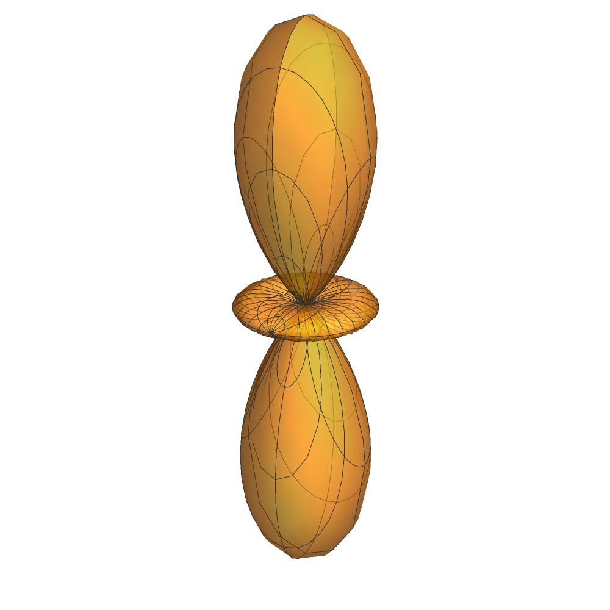
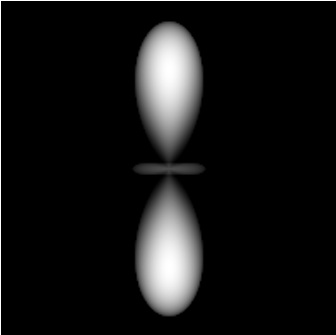
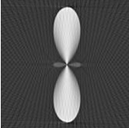

# 3D Tomographic Reconstruction of Photoelectron Angular Distributions

This project was developed as part of my M.Sc. thesis in Physics at the University of Ioannina.

It implements a **Mathematica-based simulation and reconstruction environment** for generating 2D detector projections of theoretical 3D photoelectron angular distributions and reconstructing the original distribution using tomography.

## Workflow

**Theoretical 3D distribution → Simulated 2D projections → Tomographic reconstruction → Recovered distribution**

The project consists of two Mathematica applications:

- **Simulation & Projection:** Simulates the rotation of a theoretical 3D photoelectron distribution and generates 2D detector projections at different angles using numerical integration.
- **Tomographic Reconstruction:** Imports the generated projections and reconstructs the distribution slice-by-slice using Mathematica's inverse Radon transformation.

The notebooks are available in [`notebooks/`](notebooks/).

## Example Results

### Theoretical 3D Distribution

### Simulated 2D Projection

### Tomographic Reconstruction

## Validation

For linear polarization, the tomographic reconstruction was compared with the **inverse Abel transform**. The method was also tested for circular and elliptical polarization, where the symmetry requirements of the Abel approach restrict its applicability.

Robustness was evaluated by introducing simulated noise into the projections, with reconstruction tested at noise levels up to **5% of the maximum signal**.

## Tools & Methods

`Wolfram Mathematica` · `Numerical Simulation` · `Numerical Integration` · `Tomographic Reconstruction` · `Inverse Radon Transform` · `Inverse Abel Transform`

## Author

**Konstantinos Filippou**  
M.Sc. Physics, University of Ioannina
